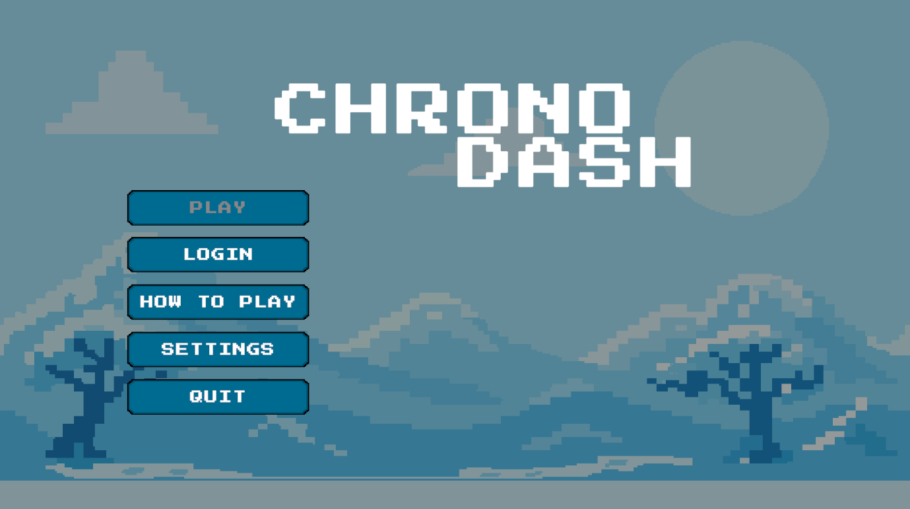
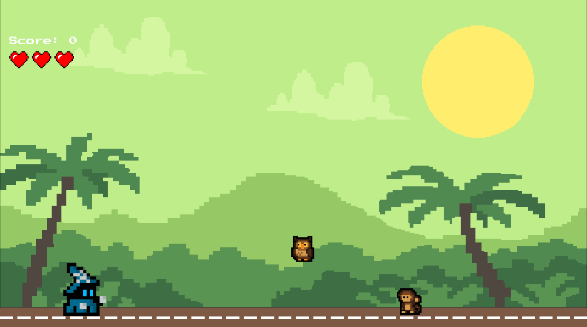
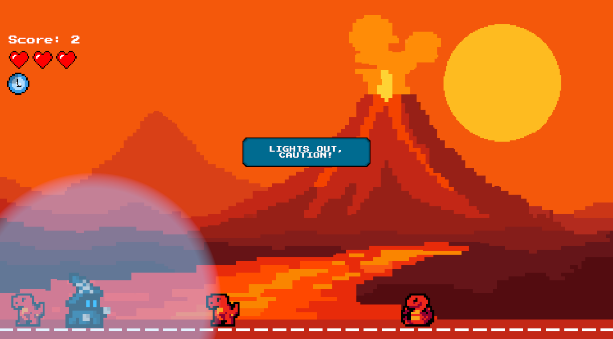
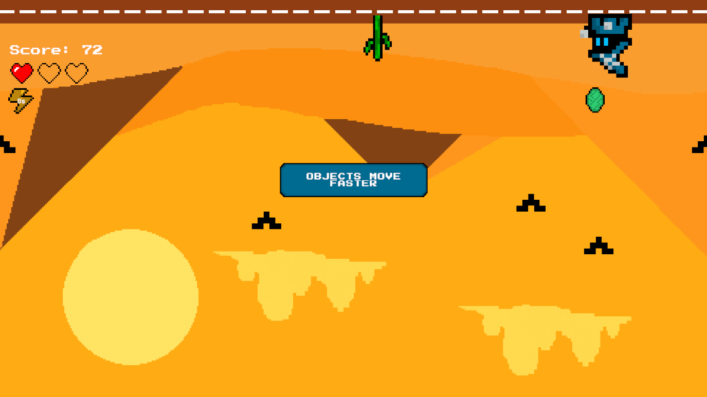
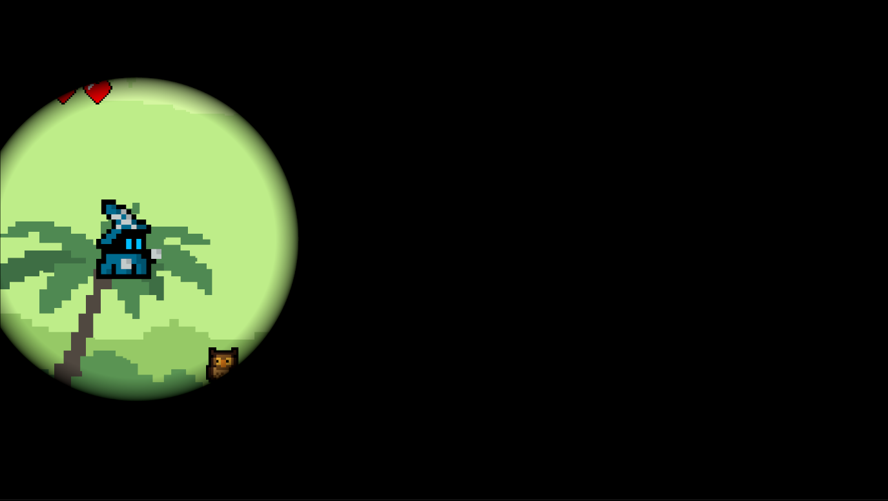
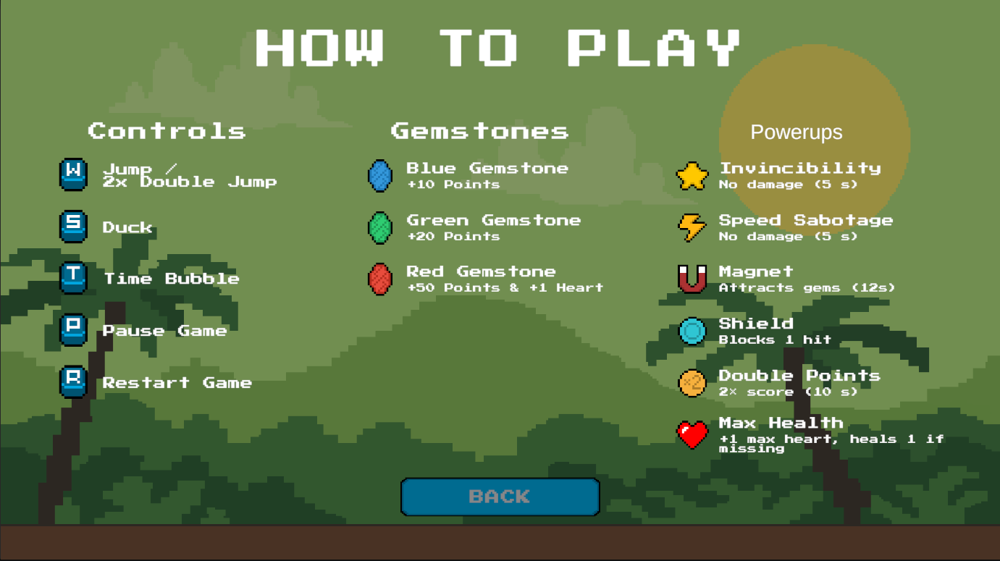
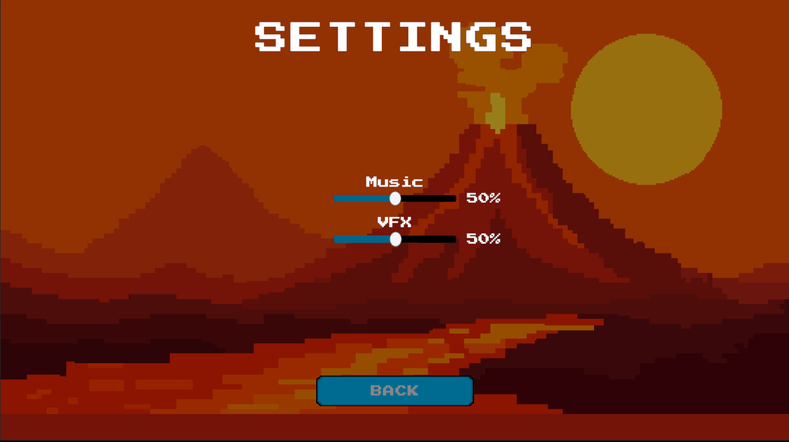
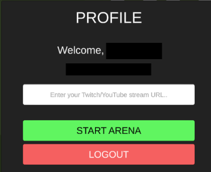

# ChronoDash

A fast-paced 2D endless runner with time manipulation and interactive streaming features via Vorld Arena Arcade.

[Play on GitHub Pages](https://talhay61.github.io/ChronoDash-Unity/)

---

## About the Game
ChronoDash is an endless runner where you dodge obstacles across four visually distinct worlds: Desert, Jungle, Ice, and Lava. The game features real-time viewer interaction through Vorld Arena Arcade.

### Power-ups
- **Invincibility**: Become immune to all obstacles for a short time.
- **Speed**: Temporarily increases your movement speed.
- **Magnet**: Attracts nearby gemstones automatically.
- **Shield**: Absorbs one hit from obstacles.
- **2x Score**: Doubles all score gains for a limited time.
- **Heart**: Restores one health and increases max health.

### Gemstones
- **Gemstones**: Collect to increase your score and trigger score multipliers.

### Effects
- **Time Bubble**: Slow down obstacles in a radius around you (Press T, 3s duration, 10s cooldown).
- **Gravity Flip**: Temporarily reverses gravity, making you run on the ceiling.
- **Screen Shake**: Shakes the camera for a short period.
- **Darkness**: Limits your vision with a spotlight effect.

---

## Features
- **Time Bubble Ability**: Slow down obstacles around you (Press T)
- **4 Worlds**: Desert, Jungle, Ice, Lava (rotate every 60 seconds)
- **6 Stackable Power-ups**: Invincibility, Speed, Magnet, Shield, 2x Score, Heart
- **Dynamic Difficulty**: More obstacles and effects as you score higher
- **Random Effects**: Gravity flip, screen shake, darkness
- **Viewer Interaction**: Viewers can send items and trigger effects during streams

---

## Controls
| Key                | Action                 |
|--------------------|------------------------|
| W                  | Jump / Double Jump     |
| S                  | Duck                   |
| T                  | Time Bubble            |
| P                  | Pause                  |
| R                  | Restart (Game Over)    |

---

## Screenshots
### Main Menu

### Gameplay

### Time Bubble Effect

### Gravity Shift Effect

### Darkness Effect

### How To Play Menu

### Settings Menu

---

## Arena Arcade Integration

ChronoDash supports Vorld Arena Arcade, allowing your Twitch/YouTube viewers to interact with your game in real time. Viewers can buy the following items using Vorld Coins:

**Viewer Purchasable Items:**
- Invincibility
- Speed
- Magnet
- Shield
- 2x Score
- Heart
- Gemstone Drop
- Gravity Flip
- Screen Shake
- Darkness

### How to Use Arena Arcade
1. Create a Vorld account at [vorld.gg](https://vorld.gg/)
2. Connect your Twitch/YouTube channel
3. Configure your game and packages in the Vorld Developer Dashboard
4. Start ChronoDash, login with Vorld, and enter your stream URL
5. Begin streaming; viewers can now interact with your game!

### Login

### Profile

---

## Technical Details
- Engine: Unity 6.0 (2D URP)
- Language: C#
- Platform: WebGL
- Networking: Socket.IO Unity
- Authentication: JWT tokens via Vorld

---

## Developer
Talha Yaz
GitHub: [@TalhaY61](https://github.com/TalhaY61)
itch.io: [@TalhaY61] (https://talhay61.itch.io/)
